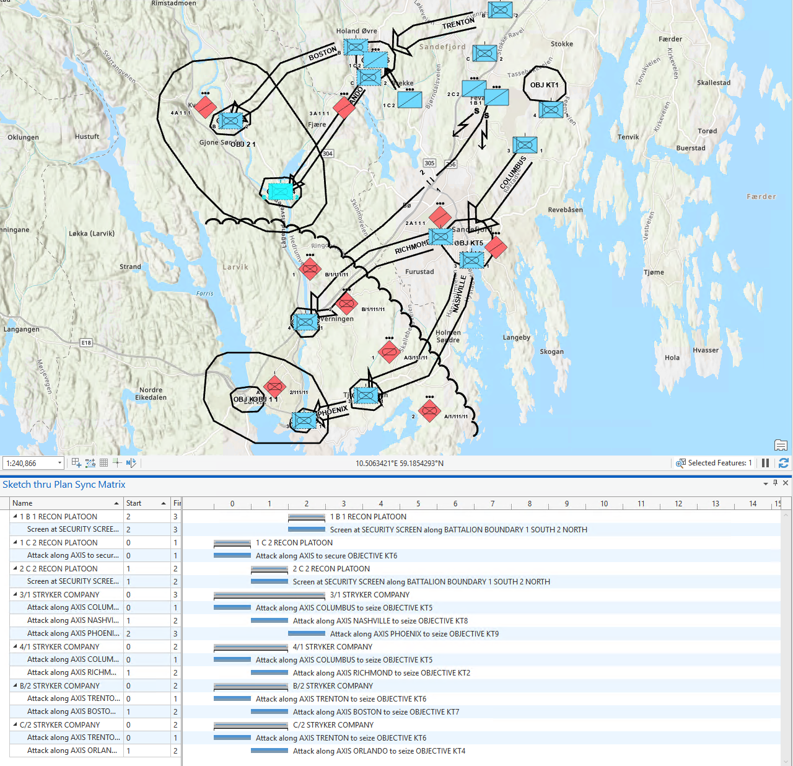

# Larvik Sketch-Thru-Plan Sample

This sample shows a more elaborate Norwegian Army unclassified plan designed in [Sketch-Thru-Plan](http://www.hyssos.com) (STP).

## Documents

This sample includes documents generated according to the more recent v1.0.1 version of the C2SIM schema ([v1.0.1](https://github.com/hyssostech/OpenC2SIM.github.io/blob/master/Standard/C2SIM/Schemas/C2SIM_SMX_LOX_v1.0.1.xsd)). For an example using the older version (v1.0.0), see the [SimpleAttack](../SimpleAttack) sample.

* [Larvik_Initialize.xml](./Larvik_Initialize.xml)
* [Larvik_Order.xml](./Larvik_Order.xml)

Sketch-Thru-Plan loadable data:
* [Larvik.op](./Larvik.op)

## Mappings

* Initialization
    * Units and are represented as ActorEntity elements
    * The subordinates of Units placed on the map that are found in the TO (A/2-69) are also included as ActorEntity elements     
    * Location elements, when provided (in CurrentState elements) correspond to the symbols' APP6/2525C standard anchor points. Some of these can therefore represent aspects other than a location per se, for example the width of an Axis of Advance 

* Order
    * Tasks are represented as ManeuverWarfareTask elements
    * Location elements provide coordinates of the route TGs. If not is present, then the Location of the center of the Objective is used
    * Tactical Graphics (TG) are represented as PhysicalEntity elements
    * References to TG associated with a task are listed as MapGraphicID elements
    * Follow on tasks make reference to the preceeding  one via a StartTime tag

