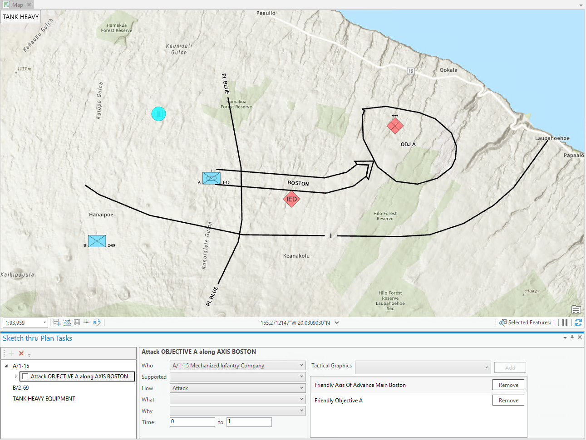

# SimpleAttack Sketch-Thru-Plan Sample

This sample shows a simple scenario designed in [Sketch-Thru-Plan](http://www.hyssos.com) (STP).

It contains a mix of symbol types to illustrate how these are included in the generated C2SIM documents that STP automatically:
* A friendly unit attacking an objective occupied by an enemy unit
* A second (non-tasked) friendly unit
* An IED along the attack route
* A friendly tank equipment

Task Org snippets are also defined:

* Mechanized Infantry Battalion 1-15
    * Mechanized Infantry COmpany A/1-15
        * Mechanized Infantry Platoon 1/A/1-15
        * Mechanized Infantry Platoon 2/A/1-15
        

## Documents

Two sets of documents are produced, matching the original ([v1.0.0](https://github.com/hyssostech/OpenC2SIM.github.io/blob/master/Standard/C2SIM/Schemas/C2SIM_SMX_LOX_v1.0.0.xsd)) version of the xml schema, and another matching the more recent ([v1.0.1](https://github.com/hyssostech/OpenC2SIM.github.io/blob/master/Standard/C2SIM/Schemas/C2SIM_SMX_LOX_v1.0.1.xsd)) amended version.

Version 1.0.1 documents:
* [SimpleAttack_Initialize101.xml](./SimpleAttack_Initialize101.xml)
* [SimpleAttack_Order101.xml](./SimpleAttack_Order101.xml)

Version 1.0.0 documents:
* [SimpleAttack_Initialize100.xml](./SimpleAttack_Initialize100.xml)
* [SimpleAttack_Order100.xml](./SimpleAttack_Order100.xml)

Sketch-Thru-Plan loadable data:
* [SimpleAttack.op](./SimpleAttack.op)

*NOTE*: Tactical Graphics are not included in v1.0.0 documents, as they prevent some of the existing tooling (e.g. the [VR-Forces Interface v2.16](https://github.com/hyssostech/OpenC2SIM.github.io/tree/master/Software/Interfaces/c2simVRFinterfacev2.16/)) from working.

## Mappings

* Initialization
    * Units and taskable equipment are represented as ActorEntity elements
    * The subordinates of Units placed on the map that are found in the TO (A/1-15) are also included as ActorEntity elements     
    * MOOTW symbols (such as IED) are represented as PhysicalEntity elements
    * Location elements, when provided (in CurrentState elements) correspond to the symbols' APP6/2525C standard anchor points. Some of these can therefore represent aspects other than a location per se, for example the width of an Axis of Advance 

* Order
    * Tasks are represented as ManeuverWarfareTask elements
    * Location elements provide coordinates of the route TGs. If not is present, then the Location of the center of the Objective is used
    * In v1.0.1:
        * Tactical Graphics (TG) are represented as PhysicalEntity elements
        * References to TG associated with a task are listed as MapGraphicID elements
